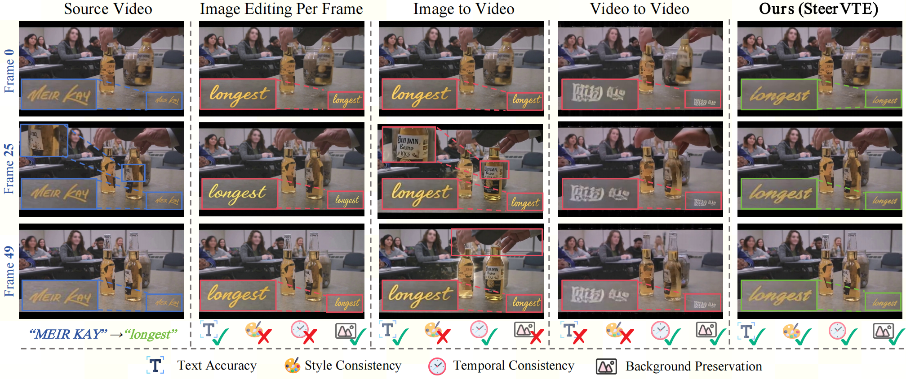

# SteerVTE: Precise Video Text Editing with Style and Glyph Control

<div align="left">
  <p align="left">
    <a href="https://arxiv.org/abs/2606.23254"></a>
    <a href="https://zengkaiya.github.io/SteerVTE/"></a>
    <a href="https://huggingface.co/MewtwoX23/SteerVTE/tree/main"></a>
    <a href="https://huggingface.co/datasets/MewtwoX23/VTE-Bench"></a>
    <a href="https://opensource.org/license/apache-2.0"></a>
  </p>
</div>

## 💡 Abstract



Visual text editing aims to precisely modify text in images and videos while preserving stylistic consistency and visual realism.
Despite significant advances in the image domain, video text editing remains largely unexplored: it is a localized task demanding stroke-level precision within small text regions, which compounds the challenges of cross-frame accuracy, temporal coherence, and stylistic fidelity.
We introduce 🔥SteerVTE🔥, a unified framework that <b>steer</b>s a frozen video diffusion model to perform precise <b>V</b>ideo <b>T</b>ext <b>E</b>diting through style and glyph control.
Built on a frozen diffusion transformer, SteerVTE attaches a lightweight text context adapter with two complementary modules: a style encoder capturing the original text's visual attributes, and dual-granularity glyph encoders encoding the target text at both the line and character levels.
To overcome the inherently weak text rendering priors of video foundation models, we further propose a glyph-aware spatial-focal loss and a three-stage progressive training curriculum that scales from image to video data.
To support large-scale training, we also develop an automatic synthesis pipeline and construct SteerVTE-1M, a dataset of one million triplets spanning diverse scenes, fonts, and stylistic effects.
Extensive experiments demonstrate that SteerVTE substantially outperforms existing video editing baselines across text accuracy, style consistency, and temporal coherence.

## 📦 Installation

```shell
# 1. Clone the repo
git clone https://github.com/zengkaiya/SteerVTE.git
cd SteerVTE

# 2. (Optional) Create a clean Python environment
conda create -n steervte python=3.11 -y
conda activate steervte

# 3. Install dependencies
# 3.1 Install PyTorch (choose correct CUDA version)
pip install torch==2.6.0 torchvision==0.21.0 torchaudio==2.6.0 --index-url https://download.pytorch.org/whl/cu124

# 3.2 Install other required packages
pip install -r requirements.txt

# We recommend install it for best performance.
pip install  --no-cache-dir flash-attn==2.7.4.post1 --no-build-isolation

# 4. Prepare the pretrained ckpt
mkdir -p models
# Please login first (hf auth login)
hf download Wan-AI/Wan2.1-VACE-14B --local-dir ./models/Wan-AI/Wan2.1-VACE-14B
hf download Qwen/Qwen2.5-VL-3B-Instruct --local-dir ./models/Qwen/Qwen2.5-VL-3B-Instruct

# 5. Donwload the SteerVTE ckpt
hf download MewtwoX23/SteerVTE --local-dir ./models/SteerVTE
```

## 🚀 Run the Demo

```shell
python infer_demo.py
```

## 📊 Run the VTE-Bench
```shell
# Donwload the VTE-Bench
hf download --repo-type dataset MewtwoX23/VTE-Bench  --local-dir VTE-Bench

NUM_GPUS=4 \
DATASET_SPECS="VTE-Bench/SceneText.csv;VTE-Bench/Real.csv;VTE-Bench/Synth.csv" \
bash infer_bench.sh

DATASET_SPECS="VTE-Bench/SceneText.csv;VTE-Bench/Real.csv;VTE-Bench/Synth.csv" \
bash eval/eval.sh
```

## 📚 Citation

If you find SteerVTE is useful in your research or applications, please consider giving us a star 🌟 and citing it by the following BibTeX entry.

```bibtex
@article{zeng2026steervte,
  title={SteerVTE: Seamless Video Text Editing with Style and Glyph Control},
  author={Zeng, Kai and Li, Moran and Wang, Zhengwei and Yu, Yingchen and Lin, Yiheng and An, Ruichuan and Lu, Ming and She, Qi and Zhang, Wentao},
  journal={arXiv preprint arXiv:2606.23254},
  year={2026}
}
```

## 🙏 Acknowledgements

SteerVTE is built upon excellent open-source works:

- [DiffSynth-Studio](https://github.com/modelscope/DiffSynth-Studio) as the training framework;
- [VACE](https://github.com/ali-vilab/VACE) as the base model.

Related Projects:

- [FLUX-Text: A Simple and Advanced Diffusion Transformer Baseline for Scene Text Editing](https://github.com/AMAP-ML/FluxText)
- [AnyText: Multilingual Visual Text Generation And Editing](https://github.com/tyxsspa/AnyText)
